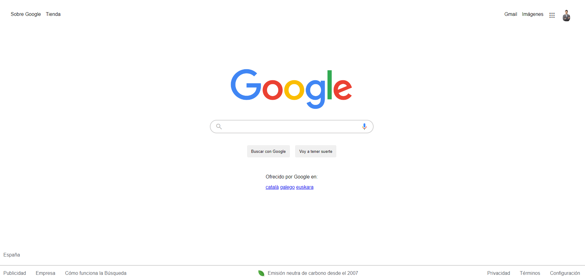
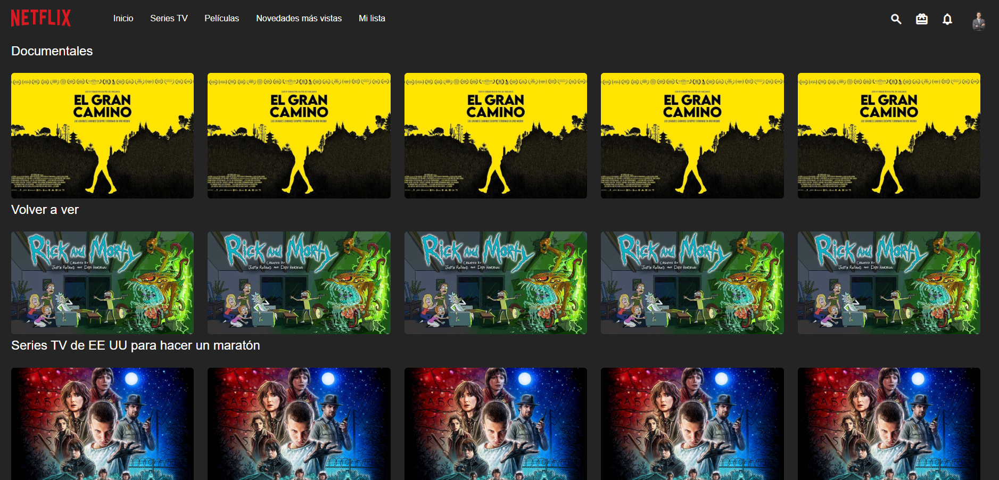

## Ejercicios de HTML y CSS

En este repositorio, encontrarás tres ejercicios prácticos de HTML y CSS que simulan la creación de páginas web para diferentes propósitos.

Puedes acceder al menú principal para ver los ejercicios haciendo clic en el siguiente enlace: [Menú Principal](https://davidtomas98.github.io/T05-CSS3-Layout/).

### Ejercicio 1: Página de Búsqueda de Google

El primer ejercicio es una página que simula la interfaz de búsqueda de Google. La página incluye una barra de búsqueda con iconos para búsqueda por voz y opciones de búsqueda. Además, cuenta con una sección de noticias y un pie de página con enlaces y derechos de autor.

#### Ver código: [Ejercicio 1](https://davidtomas98.github.io/T05-CSS3-Layout/Tarea1/index.html)

### Ejercicio 2: Motor de Búsqueda de Microsoft Bing

El segundo ejercicio representa una página de búsqueda utilizando el motor de búsqueda "Microsoft Bing". La página tiene un encabezado con enlaces y opciones de inicio de sesión, y una barra de búsqueda con varios iconos para opciones de búsqueda. También contiene una sección de noticias destacadas.

#### Ver código: [Ejercicio 2](https://davidtomas98.github.io/T05-CSS3-Layout/Tarea2/index.html)

### Ejercicio 3: Página de Inicio de Netflix

El tercer ejercicio es una página de inicio de Netflix. El diseño incluye un encabezado con un menú de navegación y opciones de búsqueda. La página muestra contenido organizado en tres secciones: "Documentales", "Volver a ver" y "Series de TV de EE UU para hacer un maratón".

#### Ver código: [Ejercicio 3](https://davidtomas98.github.io/T05-CSS3-Layout/Tarea3/index.html)

Puedes acceder a cada uno de los ejercicios haciendo clic en los enlaces "Ver código" que se encuentran junto a cada descripción. Simplemente abre los enlaces en tu navegador web para ver la representación de las páginas en GitHub Pages.
